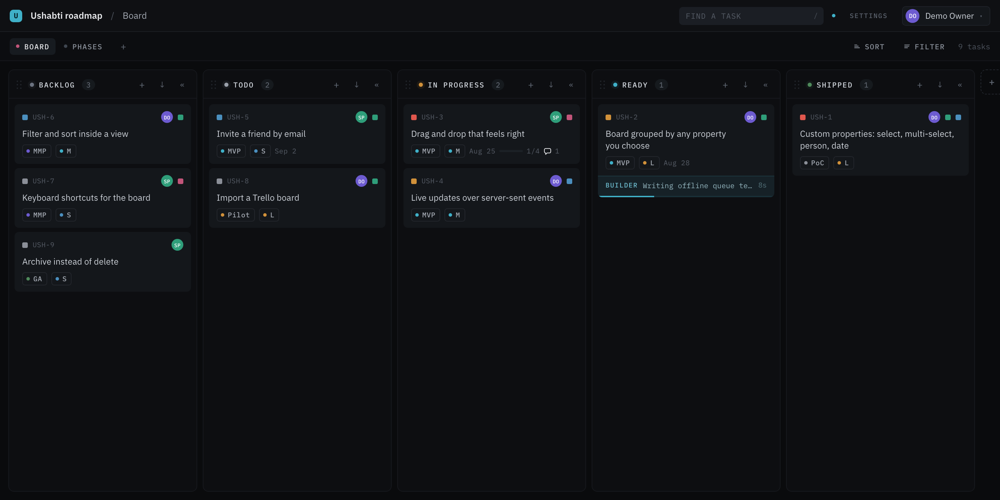
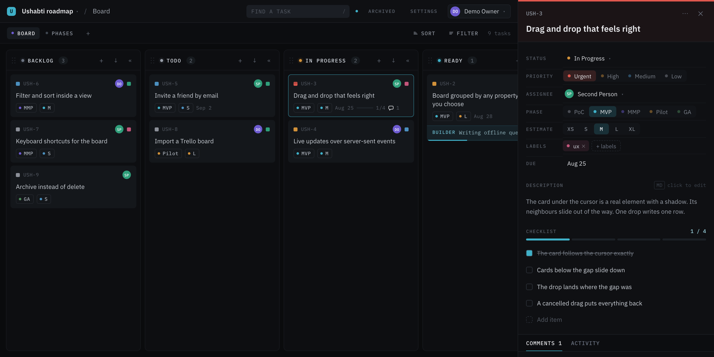

# Ushabti

[](https://github.com/jaklimoff/ushabti/actions/workflows/ci.yml)
[](https://hub.docker.com/r/jaklimoff/ushabti)
[](https://hub.docker.com/r/jaklimoff/ushabti)
[](LICENSE)

A small, fast task board. It looks like Trello, but every field on a task is a
property **you** define — including the ones a normal board hardcodes, such as
Status and Priority. A view is a board grouped by one of those properties, so
the same tasks can be looked at from more than one angle.

Free, open source, and yours to run. No seats, no trial, no locked features.



## The name

In ancient Egypt nobody expected the dead to do their own work. A tomb held
small carved figures called _ushabti_ — "those who answer". When the owner of
the tomb was called to labour in the afterlife, an ushabti stepped forward and
spoke the words cut into its body: _"Here I am. I will do it."_ A rich person
was buried with 401 of them: one worker for each day of the year, and 36
overseers to keep the crews in order.

Three thousand years later this is still a good description of a team. You write
the work down. Someone — or something — answers and does it. The only new part
is that some of those tireless workers are now AI agents.

Ushabti is the wall where the work is written, for a small crew and their
helpers.

## Why it exists

Task trackers grew into platforms. Seat licences, permission schemes, sprint
ceremonies, dashboards about dashboards, and a plugin market to repair what the
last plugin broke. A team of three needs none of that. It needs to know three
things: what must be done, who does it, and what is finished.

The free options are rarely free. Trials stop. Starter plans hold the useful
part back. Too many open source alternatives are a road to a cloud edition.

So Ushabti is:

- **Actually free.** No seat limit, no locked feature, no clock. For one person
  or for twenty, today and later.
- **Small by intent, not by neglect.** A task, a status, an owner. The features
  stop where the value stops.
- **Ready for agents.** Humans and agents will use the same simple interface to
  take a task, report on it, and close it. The interface is built; the agent
  side is [next](ROADMAP.md), not done.

Small teams deserve neat tools. Write the work down. Let your ushabti answer.

## What it does

```
Board  ·  Phases  ·  By assignee            ← views you create
┌── BACKLOG ─┐ ┌── TODO ────┐ ┌── IN PROGRESS ┐
│  USH-7     │ │  USH-5     │ │  USH-3        │
│  ...       │ │  ...       │ │  ...          │
└────────────┘ └────────────┘ └───────────────┘
      ↑ columns are the options of the grouping property
```

- **Custom properties.** Select, multi-select, person, text, number, date and
  checkbox. Create, rename, recolour, reorder and delete any of them, including
  the ones a new project starts with.
- **Views.** Each view is a board grouped by one select, person or checkbox
  property. Add as many as you like.
- **Drag and drop.** Cards move inside a column and across columns; column
  headers drag to reorder the options of the grouping property. From the
  keyboard: focus a card, **Space** picks it up, the arrow keys move it,
  **Space** puts it down, **Escape** cancels. **Enter** opens the task.
- **Task detail.** Title, markdown description, checklist with progress,
  comments and an automatic activity log, all edited in place. No dialogs.
- **Live updates.** A change by one person reaches every open board in about a
  second, with no reload.
- **Email and password sign-in.** No third party.
- **Projects with members.** The owner adds people by email.



Every property in the panel above is a row in the database. You can rename it,
recolour it or delete it. There is nothing special about Status.

## Run it

You need Docker. Nothing else.

```bash
cp .env.example .env
docker compose up         # the first run builds the image and installs packages
```

Open <http://localhost:3000>. The app container installs the packages, writes
the database schema and starts the dev server on its own.

Want something to look at straight away?

```bash
docker compose exec app npm run db:seed
```

That creates a filled demo project and two accounts:

| Email                  | Password       |
| ---------------------- | -------------- |
| `demo@ushabti.local`   | `ushabti-demo` |
| `friend@ushabti.local` | `ushabti-demo` |

Sign in as each one in two browser windows to watch the live updates.

### Host it for your team

```bash
echo "POSTGRES_PASSWORD=$(openssl rand -hex 24)" >> .env
docker compose -f docker-compose.prod.yml up -d
```

This pulls [`jaklimoff/ushabti:edge`](https://hub.docker.com/r/jaklimoff/ushabti),
applies the migrations and serves the app on `127.0.0.1:3000`. Add `--build` to
build the image here instead, or set `USHABTI_VERSION` in `.env` to pin a
released tag such as `0.1.0`.

The same image is on `ghcr.io/jaklimoff/ushabti` if you prefer the GitHub
registry. Both are built from the same commit by the same workflow.

Put a reverse proxy with TLS in front of it: in production the session cookie is
marked `secure`, so a browser will not send it back over plain `http`. Read
[SECURITY.md](SECURITY.md) before you open it to the internet.

To upgrade:

```bash
docker compose -f docker-compose.prod.yml pull
docker compose -f docker-compose.prod.yml up -d
```

New migrations are applied when the container starts.

#### Using a database you already have

Point `DATABASE_URL` at it instead of running the `db` service. Two things to
know about managed clusters:

- `node-postgres` verifies the certificate when the URL says `sslmode=require`,
  which is stricter than `libpq` and than most other drivers. Give it the
  provider's CA and ask for
  `?sslmode=verify-full&sslrootcert=/path/to/ca.crt`.
- Set `DATABASE_POOL_MAX` below the share of connections you can spare. One
  process otherwise holds up to twelve, and takes one more for live updates.

### Without Docker

Point `DATABASE_URL` at any PostgreSQL 14 or later, then:

```bash
npm install
npm run db:migrate
npm run dev
```

### VS Code dev container

`.devcontainer/devcontainer.json` points at the same compose file. "Reopen in
Container" puts your editor inside the `app` service.

## Tests

```bash
npm run lint       # ESLint
npm run format     # Prettier
npm run typecheck  # the app and the specs
npm test           # unit tests for the rank and grouping logic
npm run test:e2e   # Playwright, against the dev server
```

Every one of them runs on each pull request, together with the production build
and a CodeQL scan.

The end-to-end suite covers sign-up, task editing, both kinds of drag, custom
properties, views, members and the live updates between two browsers.

## How it is built

| Part      | Choice                                                       |
| --------- | ------------------------------------------------------------ |
| Framework | Next.js 16 App Router, server components for the first paint |
| Language  | TypeScript, strict                                           |
| Database  | PostgreSQL 18 with Drizzle ORM                               |
| Drag      | dnd-kit, one context for cards and columns                   |
| Live      | Server-sent events fed by Postgres `LISTEN`/`NOTIFY`         |
| Auth      | scrypt password hashes, a random session id in the database  |
| Styling   | CSS modules, no framework                                    |

### The data model

```
users ── project_members ── projects
                               ├── properties ── property_options
                               ├── views          (name + grouping property)
                               └── tasks ── task_values   (task × property → JSON)
                                        ├── checklist_items
                                        ├── comments
                                        └── activity
```

`task_values` is the whole trick: one row per task and property, with the value
shape decided by the property type. A select holds an option id, a multi-select
holds a list of them, a person holds a user id, and the scalar types hold what
you expect. Adding a property type means adding one branch in
`src/lib/values.ts` and one control in
`src/components/board/controls/PropertyControl.tsx`.

### Ordering

Cards carry a **fractional rank** — a base-62 string. Dropping a card between
two neighbours computes a string that sorts between theirs, so a drag writes one
row instead of renumbering a column. See `src/lib/rank.ts`; the unit test drives
ten thousand random moves through it.

One caution worth knowing: rank strings mix upper and lower case, and the
default PostgreSQL collation sorts case-insensitively. Every ordering query
therefore asks for `COLLATE "C"` — see `src/lib/order.ts`.

### Layout of the source

```
src/
  app/            routes: pages and the JSON API
  components/
    board/        the board, the columns, the cards, the detail panel
    settings/     properties, views and members
    ui/           avatar, user menu, dismiss hook
  db/             schema, client, seed
  lib/            auth, ranks, grouping, value rules, events
e2e/              Playwright specs
drizzle/          generated migrations
design-reference/ the source design this interface follows
```

## Take part

- [ROADMAP.md](ROADMAP.md) — what is done, what comes next, and the known limits.
- [CHANGELOG.md](CHANGELOG.md) — what changed in each release. Versions follow semantic versioning; `:edge` is the newest commit, a number is a release.
- [CONTRIBUTING.md](CONTRIBUTING.md) — how to set up, test and send a change.
- [SECURITY.md](SECURITY.md) — how to report a weakness, and what is already known.
- [CODE_OF_CONDUCT.md](CODE_OF_CONDUCT.md) — be courteous.

## Licence

MIT. See [LICENSE](LICENSE).
